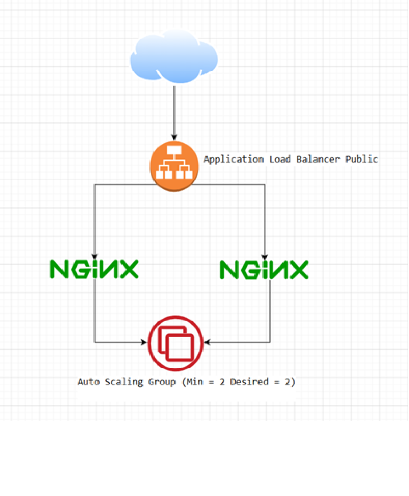

## Steps to run 

terraform init 

## Diagram

Diagram

## Format and validate 

terraform fmt -check -recursive 
terraform validate 

## Create a plan 

terraform plan -out tfplan 

## Apply the plan 

terraform apply tfplan 

## Outputs 
## After apply, Terraform outputs: 
alb_dns_name 
alb_url asg_name 
target_group_arn 

## Open alb_url in a browser to confirm the NGINX welcome page is displayed. 
## After a successful deployment, running:
 
terraform plan 

Should show no changes unless: 
variables changed 
infrastructure drift occurred 
AWS-side defaults changed

## Self-healing test

Find one instance created by the Auto Scaling Group 
Manually terminate it in the AWS Console or CLI 

Verify: 
# ***The ALB still serves traffic*** 
# ***The remaining instance continues serving requests*** 
# ***Auto Scaling launches a replacement instance automatically*** 
***Desired capacity returns to 2*** 
***This demonstrates the platform can lose any single VM without service interruption.***
